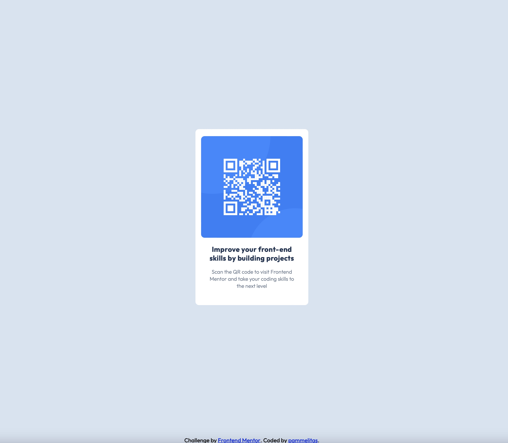

# Frontend Mentor - QR code component solution

This is a solution to the [QR code component challenge on Frontend Mentor](https://www.frontendmentor.io/challenges/qr-code-component-iux_sIO_H). Frontend Mentor challenges help you improve your coding skills by building realistic projects. 

## Table of contents

- [Overview](#overview)
  - [Screenshot](#screenshot)
  - [Links](#links)
- [My process](#my-process)
  - [Built with](#built-with)
  - [What I learned](#what-i-learned)
  - [Continued development](#continued-development)
  - [AI Collaboration](#ai-collaboration)
- [Author](#author)
- [Acknowledgments](#acknowledgments)

## Overview
QR Code Component

First FrontEnd mentor challenge to refresh HTML and CSS knowledge.
The card layout doesn't shift, so it is ideal to refresh the basic
concepts before diving into responsive design.

### Screenshot

### Links

- Solution URL: (https://github.com/pamelaherrerade/qr-code_component)
- Live Site URL: 

## My process

### Built with

- Semantic HTML5 markup
- CSS custom properties
- Flexbox

### What I learned

This project was like a breath of fresh air after almost two years of
not doing anything web design related. It felt good to know the previous knowledge I had is still there, and I felt it was quite an easy challenge. I'm very exited for the upcoming ones!

### Continued development

This project did not use responsive design, so I am eager to start the next ones and see how will I be managing the media queries to provide the best UX.

### AI Collaboration

I used Copilot for this project. I used it while I was having some issues to resize the qr code image, it suggested I get the measurements from Figma and start coding from there, it was way easier!

## Author

- Frontend Mentor - [@pammelitas](https://www.frontendmentor.io/profile/pamelaherrerade)
